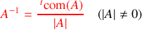
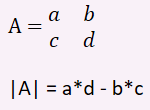
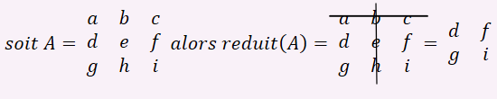
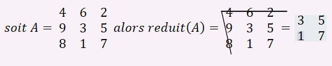
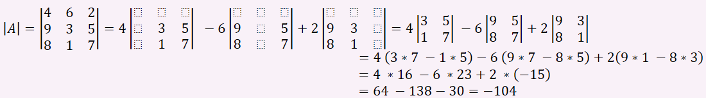
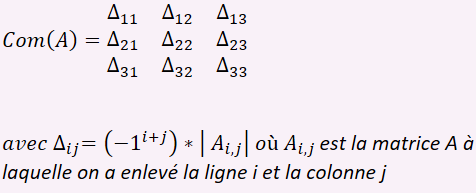
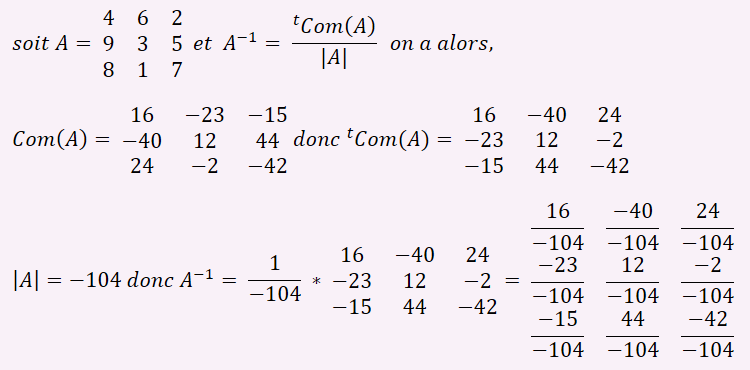

# Librairie python: libmatrice

>## *Qu'est-ce qu'une librairie ?*

Une **librairie** est un ensemble de **modules** (aussi appelés **fonctions**) qui peuvent être utiliser dans plusieurs programmes.
Cela évite d'écrire tout le temps la même chose dans plusieurs programmes.

*Ah je vois, c'est beaucoup plus pratique !*

>## *Mais qu'est-ce qu'une fonction ?*

Une fonction est un morceau de programme qui permet de **réaliser plusieurs taches** et qui prend en compte des **parametres**.

Pour créer une fonction nous allons utiliser la fonction *def* :

```python
def ma_fonction(parametre):
    *fait quelque chose*
    return resultat
```

*Je comprends mieux. Mais si je peux l'utiliser dans plusieurs programmes...*
>## *Comment je l'ajoute dans d'autres programmes ?*

C'est très simple il suffit de l'appeller avec la commande *import* :

```python
from ficher_contenant import *
```

On utilise la commande *from* et le signe *, pour dire :
« Dans le fichier "fichier_contenant" on importe tout. »
Vous l'aurez compris, on utilise *from* pour dire que on chercher dans le fichier et le signe * signifie simplement tout.

*Ah oui je vois, donc si libmatrice est une librairie...*

>## Que fait la librairie libmatrice ?

La librairie libmatrice contient toutes les fonctions qui permettent d'inverser une matrice 3x3.

>## Comment on inverse une matrice ?

L'inverse d'une matrice c'est la transposée de sa comatrice divisée par son déterminant.



Pour cela il y a des étapes à réaliser avant de pouvoir appliquer cette formule.

On commence d'abord par faire une fonction nous permettant de calculer le déterminant d'une matrice 2x2, pour cela rien de bien compliqué :



On obtient l'algorithme suivant :

    VERIFICATION de la taille de la matrice AVEC 2 lignes et 2 colonnes
    CALCUL de la valeur de a * d puis de c * b
    SOUSTRACTION des deux résultats obtenus
    RENVOIE la valeur du déterminant calculé

Voilà à quoi ressemble ces instructions une fois traduites en python :

```python
def det2(mat):
    #Test si la matrice est une matrice carré de taille 2
    if len(mat) != 2 or len(mat[0]) != 2 or len(mat[1]) != 2:
        return 'error'
    #Calcul a*d
    a = mat[0][0] * mat[1][1]
    #Calcul b*c
    b = mat[0][1] * mat[1][0]
    #Calcul déterminant
    determinant2 = a - b
    return determinant2
```

En testant notre code pour une matrice quelconque, le résultat suivant est renvoyé :

```python
import libmatrice as l
mat = [[4, 6], [9, 3]]
print(l.det2(mat))
Résultat: -42
```

En effet pour calculer det2 il faut faire 4 * 3 - 6 * 9 = 12 - 54 et le résultat est bien -42.

*Donc là on vient de calculer le determinant d'une matrice 2x2. Et après ?*

Ensuite, on doit réduire notre matrice 3x3 (celle que l'on veut inverser) en une matrice 2x2 pour obtenir une partie du calcul nécessaire pour calculer son déterminant.

>## Comment on réduit une matrice 2x2 en une matrice 3x3 ?

On doit choisir une ligne et une colonne à enlever pour avoir une matrice 2x2, disons que l'on souhaite enlever la 1ère ligne et la 2ème colonne. Voilà ce que ça donne pour nous :



Mais pour l'ordinateur ce n'est pas aussi simple, voilà comment voir le problème du point de vue de l'ordinateur :

    La fonction PREND EN PARAMETRE la matrice 3x3, appellée mat, la ligne à enlever, ligne, et la colonne à enlever, colonne.
    On INITIALISE une matrice 2x2, appelée mat2, avec toutes ses valeurs à 0 pour que ça soit plus simple à modifier.
    On INITIALISE ml à 0, cette variable nous permettra de savoir quel valeur de notre mat2 nous allons modifier.
    On PARCOURT chaque ligne de notre matrice 3x3.
    On VERIFIE que la ligne que l'on parcourt actuellement EST DIFFERENTE de la ligne que l'on veut enlever.
    On INITIALISE ensuite mc qui à la même vocation que ml mais pour les colonne.
    On PARCOURT LES COLONNES de notre matrice 3x3.
    On VERIFIE que la colonne que l'on parcourt n'est pas celle que l'on veut enlever.
    On RECUPERE LA VALEUR de la ligne et de la colonne que l'on parcourt actuellement pour la rentrer dans mat2 à la ligne ml et à la colonne mc.
    On INCREMENTE mc à chaque fois qu'on PARCOURT une colonne valide et ml à chaque ligne valide.
    On a donc notre matrice, mat2, avec les valeurs que nous voulons.
    On RENVOIE ensuite notre matrice 2x2.

*Mais c'est super compliqué !*

Tout à fait, voilà comment cela rends une fois traduit en python :

```python
def reduit(mat,ligne,colonne):
# Initialisation de la matrice 2x2
    mat2 = [[0,0],[0,0]]
# Initialisation de ml à 0
    ml = 0
# On parcourt ici les lignes de notre matrice 3x3
    for l in range (0,3):
# On vérifie que l'on ne parcourt pas la ligne que l'on souhaite enlever
        if l != ligne:
# On initialise mc à 0
            mc = 0
#On parcourt les colonnes de la matrice 3x3
            for c in range (0,3):
# On vérifie qu'on ne rentre pas dans les valeurs de la colonne que l'on souhaite enlever
                if c != colonne:
# On récupère les valeurs dont nous avons besoin pour les ajouter dans notre matrice 2x2 à leur place
                    mat2[ml][mc] = mat[l][c]
# On incrémente mc pour modifier la valeur de la prochaine colonne de la matrice 2x2
                    mc += 1
# On incrémente ml pour modifier la valeur de la prochaine ligne de la matrice 2x2
            ml += 1
# On renvoie notre matrice 2x2 avec les valeurs voulues
    return mat2
```

Maintenant il faut tester ce programme :

```python
import libmatrice as l
mat = [[4, 6, 2], [9, 3, 5], [8, 1, 7]]
print(l.reduit(mat, 0, 0))
Résultat: [[3, 5], [1, 7]]
```

*En fait ça revient supprimer des lignes ?*

En effet pour calculer reduit il faut supprimer une ligne et une colonne et donc dans ce cas là cela donne cela donne bien :



*Maintenant qu'on sait réduire cette matrice 3x3 pour calculer son determinant qu'est-ce qu'on attend ?*

Maintenant que nous savons réduire une matrice 3x3 en matrice 2x2 et calculer son déterminant, on peut calculer celui de notre matrice mère,le calcul est cependant un peu plus compliqué,


*Je commence à voir trouble, c'est normal ?*

Pas de panique ! On reconnait ici la réduction de notre matrice ainsi que le calcul de son déterminant, pour l'algorithme nous allons réutiliser les fonctions que nous avons faite juste avant,

    On VERIFIE SI la matrice est conforme et fait la bonne taille
    Ensuite on UTILISE LES FONCTIONS antérieures pour réaliser le calcul précédemment cité
    On RENVOIE le résultat obtenu

C'est une fonction relativement simple à programmer une fois que nous avons les autres, voilà ce qu'elle donne en python :

```python
def det3(mat):
#Condition taille 
    if len(mat)!=3 or len(mat[0])!=3 or len(mat[1])!=3 or len(mat[2])!=3:
        return 'error'
# Calcul du déterminant
    determ3 = mat[0][0] * det2(reduit(mat,0,0)) - mat[0][1] * det2(reduit(mat,0,1)) + mat[0][2] * det2(reduit(mat,0,2))
    return determ3
```

Petit test de notre code :

```python
import libmatrice as l
mat = [[4, 6, 2], [9, 3, 5], [8, 1, 7]]
print(l.det3(mat))
Résultat: -104
```

Et le voilà verifié :



*Ah oui en effet ce n'est pas si compliqué !*

Nous allons maintenant voir comment calculer la comatrice d'une matrice 3x3.

>## Comment on calcule une comatrice ?

 Pour cela rien de plus simple, il suffit d'appliquer cette belle formule :



Pour l'algorithme derrière la fonction, on va encore utilisé les fonctions que nous avons fait auparavant :

    POUR la comatrice, on INITIALISE une matrice 3x3 à 0
    On PARCOURT ensuite les lignes et les colonnes de la matrice passée en paramètre
    On CALCUL du delta ▲(i,j) POUR CHAQUE composant de la matrice passée en paramètre
    On OBTIENT la matrice avec les bonnes valeurs
    On RENVOIE la matrice créée

Pour le code voilà ce qu'on obtient :

```python
def comatrice(mat):
    comatrice = [[0,0,0],[0,0,0],[0,0,0]]
    for i in range (0,3):
        for j in range (0,3):
            comatrice[i][j] = (-1)**(i+j)*det2(reduit(mat,i,j))
    return comatrice
```

On effectue alors le test de notre fonction,

```python
import libmatrice as l
mat = [[4, 6, 2], [9, 3, 5], [8, 1, 7]]
print(l.comatrice(mat))
Résultat: [[16, -23, -15], [-40, 12, 44], [24, -2, -42]]
```

*Donc là, on a la matrice reduite, son determinant et sa comatrice...*

Oui, il ne manque plus qu'à utiliser la formule du début.


    On RECUPERE la transposee de la comatrice
    On PARCOURT les lignes et colonnes de la matrice
    On DIVISE les composants par le déterminant de la matrice 
    On RETOURNE le résultat obtenu qui est notre matrice inversée

```python
def inverse(mat):
    transpose_comatrice = transpose(comatrice(mat))
    for i in range (0,3):
        for j in range (0,3):
            transpose_comatrice[i][j] = transpose_comatrice[i][j] / det3(mat)
    return transpose_comatrice
```
Soit :



*Je comprends mieux comment ça marche, je vais de ce pas télécharger cette librairie, merci beaucoup !*